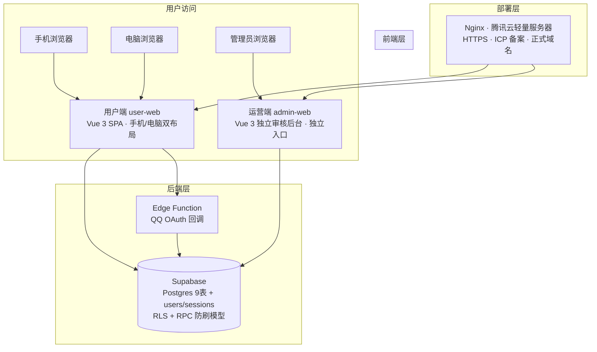

# CHU-小麦点歌台 · 项目开发计划

> 版本：v1.0 ｜ 拟定日期：2026-09-22 ｜ 状态：方案评审中
>
> 本文档整合两轮技术论证的结论：① QQ 互联实名改造方案；② 整体现代化架构升级方案。
> 外部事务（域名、ICP 备案、服务器采购、QQ 互联申请）由团队自行推进，不在本文档的代码范围内。

---

## 1. 项目背景与目标

### 1.1 现状痛点

当前平台为纯静态前端（原生 JS ES Module，无框架）+ Supabase 后端，部署于 GitHub Pages：

- **身份标识**：仅依赖浏览器 Cookie `chu_xiaomai_voter_id`（8-128 位随机串），**清 Cookie 即可绕过全部每期上限与限频**，抗干扰（防刷票）能力不强。
- **单一界面**：用户端与管理端共用同一个页面，管理员登录后在同一界面操作。
- **单一呈现**：没有针对手机 / 电脑的差异化布局。
- **部署受限**：GitHub Pages 为境外节点，无法承接 ICP 备案，正式域名无法接入。

### 1.2 升级目标

1. 接入腾讯体系账号登录（QQ 互联优先），以 openid 实现"一人一号"间接实名；
2. 独立的现代化运营端（审核）界面；
3. 现代化前端工程（组件化、工程化），告别单文件原生 JS；
4. 手机端与电脑端差异化呈现（一个网站两种使用规范）；
5. 用户端与运营端彻底分离，各自独立入口。

---

## 2. 需求清单

| # | 需求 | 说明 |
|---|------|------|
| ① | 腾讯验证（QQ 登录） | 直接 QQ 登录后使用网站，openid 一人一号 |
| ② | 现代化审核界面 | 运营端独立后台，可租用服务器承载 |
| ③ | 现代化网页呈现 | 组件化前端框架，替代静态单文件 |
| ④ | 手机 / 电脑双呈现 | 手机端点开用手机规范，电脑打开用电脑规范 |
| ⑤ | 客户端 / 运营端分离 | 用户一个页面，管理员独立入口 |

---

## 3. 技术可行性论证

| # | 需求 | 结论 | 技术方案 | 复杂度 | 新增成本 |
|---|------|------|----------|--------|----------|
| ① | QQ 登录 | ✅ 高 | QQ 互联 OAuth2.0 + Supabase Edge Function 回调 + `users`/`sessions` 表 | 中 | 0 元 |
| ② | 现代化审核界面 | ✅ 高 | 运营端独立 SPA（Vue 3 + Element Plus），审核 / 举报 / 征集期 / 防作弊明细可视化 | 中-高 | 服务器 28-78 元/年 |
| ③ | 现代化前端 | ✅ 高 | Vue 3 + Vite + Pinia 组件化重构，替代现有 `public/app.js`（约 2230 行） | 中（迁移工作量） | 0 元 |
| ④ | 手机 / 电脑双呈现 | ✅ 高 | 一套代码、两套布局：设备感知切换布局组件，业务逻辑 / API 共享 | 低-中 | 0 元 |
| ⑤ | 用户端 / 运营端分离 | ✅ 高 | 两个前端应用共享 Supabase 后端，独立入口 + 独立权限模型 | 中 | 0 元 |

**结论**：5 条需求全部可行，且属于同一"架构升级"的三个面（身份权限模型 / 前端工程化 / 呈现策略），不是五个独立项目。

---

## 4. 整体架构



- **用户端**：学生入口，QQ 登录后点歌 / 点赞 / 点踩 / 举报，按设备切换布局。
- **运营端**：广播台成员入口，审核歌曲、处理举报、管理征集期与公告、防作弊明细导出、安全设置。
- **后端**：继续使用 Supabase 云托管（免费额度），RLS 安全模型与 11 个 RPC 沿用，只做增量扩展。
- **部署**：租用的轻量服务器只承担"静态托管 + 反向代理 + HTTPS"，不承担业务后端。

---

## 5. QQ 登录技术方案（实名核心 · 需求①）

### 5.1 设计原则

- **身份键归一**：`voter_cookie` 列继续作为统一"身份键"，登录用户写入 `user:<uuid>`（含冒号，永不与合法 Cookie 格式 `^[A-Za-z0-9_-]+$` 冲突），游客保持原样。现有唯一索引、计数、限频逻辑全部复用。
- **双轨过渡**：登录用户走 openid 严格路径；游客暂留 Cookie 路径；管理员可一键强制登录。
- **零信任**：前端传什么身份都不可信，只信 Edge Function 签发的会话 token。

### 5.2 认证流程

1. 前端生成随机 `state`，跳转 QQ 授权页；
2. 用户确认授权，QQ 302 回调 Edge Function（带 `code` + `state`）；
3. Edge 校验 state（防 CSRF）→ 用 `code + appid + appkey` 换 access_token；
4. 用 access_token 换 **openid**（同一 QQ 号同一应用下恒定，换 QQ 号才变）——一人一号的根；
5. Edge upsert `users` 表 + 签发 64 字节随机 session token 入库；
6. 302 回前端，URL 带 `?session=token`；
7. 前端存 token 到 localStorage，随即从 URL 清除；此后所有 RPC 带 `p_user_token`；
8. RPC 内 `validate_session_token` 校验 → 得 user_id → 按人限频 / 去重 / 记录。

### 5.3 数据库设计（增量）

```sql
-- ① 用户表：一人一号的根
create table if not exists public.users (
  id uuid primary key default gen_random_uuid(),
  qq_openid text unique,          -- QQ 登录主键，唯一约束 = 一人一号
  wx_openid text unique,          -- 预留：拿到学校主体后可加微信双登录
  nickname text,
  avatar_url text,
  last_login_at timestamptz not null default now(),
  created_at timestamptz not null default now()
);

-- ② 会话表：Edge 签发、服务端校验、可吊销
create table if not exists public.sessions (
  token text primary key,         -- 64 字节随机 hex（存哈希更稳妥）
  user_id uuid not null references public.users(id) on delete cascade,
  expires_at timestamptz not null default now() + interval '30 days',
  last_seen_at timestamptz,
  created_at timestamptz not null default now()
);
create index if not exists sessions_user_idx on public.sessions (user_id);

-- ③ 审计列（管理端防作弊导出区分身份；业务逻辑不依赖）
alter table public.song_likes add column if not exists user_id uuid references public.users(id) on delete set null;
alter table public.song_dislikes add column if not exists user_id uuid references public.users(id) on delete set null;
alter table public.song_reports add column if not exists reporter_user_id uuid references public.users(id) on delete set null;
alter table public.vote_attempts add column if not exists voter_user_id uuid references public.users(id) on delete set null;

-- ④ 强制登录开关（管理员控制）
alter table public.security_settings add column if not exists require_login boolean not null default false;
```

> 上述 SQL 作为增量迁移追加到 `supabase-schema.sql` 末尾（或独立迁移文件），不动现有表结构。

### 5.4 RPC 改造清单

核心新增 1 个函数：

```sql
create or replace function public.validate_session_token(p_token text)
returns uuid
language plpgsql security definer set search_path = public
as $$
declare v_user_id uuid;
begin
  select user_id into v_user_id
  from public.sessions
  where token = p_token and expires_at > now();
  if v_user_id is null then
    raise exception '登录已失效，请重新登录。';
  end if;
  update public.sessions set last_seen_at = now() where token = p_token;
  return v_user_id;
end;
$$;
```

| RPC | 改动 |
|-----|------|
| `validate_session_token` | **新增**（上） |
| `toggle_song_like` / `toggle_song_dislike` | 加 `p_user_token` 参数；有 token → `identity_key := 'user:'\|\|validate_session_token(token)`，无 → 走原 `assert_valid_voter_cookie`；后续逻辑不变 |
| `submit_song` | 同上；`created_by` 登录时改为 `'user:' \|\| md5(user_id::text)` |
| `get_my_likes` / `get_my_dislikes` | 加 `p_user_token` 参数，算出 identity_key 再查 |
| `record_rate_limited_attempt` | 不改（identity_key 已归一，限频自然按人统计） |
| `assert_valid_voter_cookie` | 不改（游客路径保留） |
| 管理端 4 个 RPC | 不改 |

权限补充：`sessions` 表对 `anon/authenticated` 全 revoke（仅 Edge Function 的 service_role 写、RPC 读校验）。

### 5.5 Edge Function 设计

| 项 | 内容 |
|----|------|
| 函数 | `qq-oauth-callback`（GET，公开可访问） |
| 回调地址 | `https://你的域名/functions/v1/qq-oauth-callback`（填到 QQ 互联后台） |
| 环境变量 | `QQ_APP_ID`、`QQ_APP_KEY`、`BASE_URL`、`SUPABASE_SERVICE_ROLE_KEY`（均不进前端） |
| 流程 | 校验 state → code 换 access_token → 换 openid → upsert users → 签发 session → 302 回前端 |
| 安全 | state 随机数比对（防 CSRF）；QQ 的 code 单次有效；token 存哈希 |

### 5.6 前端改造点（现状代码映射）

| 位置 | 现状 | 改造 |
|------|------|------|
| `public/app.js:8` | `VISITOR_COOKIE_NAME` | 新增 `SESSION_KEY = "chu_xiaomai_session_token"` |
| `public/app.js:254-279` `bootSupabase` | 直接 `getOrCreateVisitorId()` | 先恢复 token → 预检登录态 → 再初始化；`state.userToken` / `state.isLoggedIn` |
| `public/app.js:349/359` `get_my_likes/dislikes` | 传 cookie | 加 `p_user_token: state.userToken` |
| `public/app.js:398` `submit_song`、`511-558` toggle | 传 cookie | 同上 |
| `public/app.js:2102` `canMutateCurrentPeriod` | 只看 userId + 期次 | `require_login` 开启时检查登录态 |
| 新增 `login.js` | — | `loginWithQQ()`（生成 state 跳转）、`consumeSessionToken()`（落地并清 URL） |

> 注：以上为在现有原生代码上改造的映射；若按第 6 节做 Vue 重构，同一逻辑落入对应模块（auth store / api 层）。

---

## 6. 前端现代化方案（需求②③④⑤）

### 6.1 用户端（user-web）

- Vue 3 + Vite + Pinia + Vue Router + **Vant**（移动端优先组件库）。
- **双布局策略**（需求④）：一套代码、两套布局组件，按设备（视口宽度断点 + 能力检测）自动切换：
  - 手机布局：底部 Tab 导航、卡片流、大按钮；
  - 电脑布局：侧栏、多列表格、宽屏信息密度。
  - 业务逻辑、状态管理、API 层完全共享，只换"皮"。
- 路由建议：`/`（点歌首页）、`/submit`（投稿）、`/history`（往期歌单）等。

### 6.2 运营端（admin-web）

- Vue 3 + Vite + Element Plus（桌面管理组件），独立入口（`/admin` 或子域，待决策）。
- 功能模块：
  - 歌曲审核（点赞 / 点踩 / 锁定）；
  - 举报处理（`review_song_report` 现有 RPC 复用）；
  - 征集期管理（创建 / 归档 / 公示状态）；
  - 公告管理；
  - 防作弊明细导出（区分 `user:` 与 `cookie:` 身份）；
  - 安全设置（限频阈值、`require_login` 开关、管理员白名单）。

### 6.3 权限模型（需求⑤）

| 角色 | 入口 | 能力 |
|------|------|------|
| 匿名游客 | 用户端 | 仅浏览（`require_login` 开启后不能投） |
| QQ 用户 | 用户端 | 登录后点歌 / 点赞 / 点踩 / 举报 |
| 管理员 | 运营端 | 全部运营功能（`is_current_user_admin` 判定，可扩展 QQ 白名单） |

### 6.4 工程组织

单仓库双包：

```
Chu-xiaomai/
├─ apps/
│  ├─ user/          # 用户端 SPA
│  └─ admin/         # 运营端 SPA
├─ supabase/
│  ├─ migrations/    # 增量迁移（users/sessions 等）
│  └─ functions/     # Edge Functions（qq-oauth-callback）
└─ docs/             # 开发计划、使用说明等文档
```

---

## 7. 技术栈汇总

| 层 | 选型 | 理由 |
|----|------|------|
| 用户端 | Vue 3 + Vite + Pinia + Vant | 移动端优先，中文生态最好，与现有 JS 心智接近 |
| 运营端 | Vue 3 + Vite + Element Plus | 桌面管理后台成熟组合 |
| 后端 | Supabase 云托管（现状）+ Edge Functions | 后端不重写，RLS / RPC 沿用 |
| 部署 | 腾讯云轻量服务器 + Nginx + HTTPS | 一个服务器托管双前端 + 反代 + 承接备案 |
| 域名 | 学校授权域名 | ICP 备案后使用 |

---

## 8. 迁移路线与里程碑

| 阶段 | 内容 | 预计周期 | 依赖 |
|------|------|----------|------|
| 1 | QQ 登录后端落地（users/sessions 表 + validate_session_token + Edge Function） | 1 周 | 无（可立即开工） |
| 2 | 用户端 Vue 重构（移动端优先 + 双布局） | 1-2 周 | 阶段 1 的 API |
| 3 | 运营端独立后台 admin-web | 1-2 周 | 阶段 1 的 API |
| 4 | 部署上线（服务器 + 域名 + 备案 + 双应用路由，线上切换） | 备案周期（约 1-4 周，撞节假日顺延） | 备案通过 |

- 阶段 1-3 可并行开发；阶段 4 受 ICP 备案与 QQ 互联审核进度制约。
- 旧站（GitHub Pages）可并行运行到新站稳定后切换，降低风险。

---

## 9. 成本总账

| 项目 | 费用 | 说明 |
|------|------|------|
| QQ 互联 | 0 元 | 官方声明免费，个人开发者可注册 |
| 域名 | 0 元 | 学校授权 |
| ICP 备案 | 0 元 | 需境内服务器作接入商 |
| 轻量服务器（2核2G） | 约 28-78 元/年 | 学生 / 新用户特惠 |
| Supabase + Edge Functions | 0 元 | 免费额度足够 |
| SSL 证书 | 0 元 | 腾讯云 / Let's Encrypt 免费证书 |

**年固定支出约 30-100 元。**

---

## 10. 待决策项

1. **前端框架**：默认 Vue 3；如团队更熟 React 可替换，方案结构不变。
2. **双端呈现**：默认"一套代码双布局"；若坚持两个独立站点，维护成本翻倍，不建议。
3. **运营端入口**：同域 `/admin`（省事，一个证书）vs 独立子域 `admin.域名`（更干净，多配证书）。
4. **管理员认证**：QQ 白名单（体验统一）vs 保留现有邮箱密码。
5. **主体选择**：单位备案（需学校证件 + 授权盖章）vs 个人备案（网站名不含学校全称），影响备案与 QQ 互联审核。

---

## 11. 验收标准

1. 同一 QQ 登录后，清 Cookie 再投，每期上限不重置（核心目标）。
2. 换 QQ 号才能继续投，IP 限频（120/min）仍兜底。
3. `require_login = true` 后，游客无法点赞 / 投稿。
4. 管理端防作弊明细可区分 `user:` 与 `cookie:` 身份。
5. 用户端手机 / 电脑呈现各自符合使用规范，共享业务逻辑。
6. 运营端独立入口，游客无法访问管理功能。
7. 现有匿名流程、管理员流程回归不破坏。

---

## 12. 外部前置事项（团队自行推进）

| 事项 | 要点 |
|------|------|
| 域名实名认证 | 新注册域名必须先实名，否则无法解析 / 备案 |
| ICP 备案 | 个人 / 单位主体选型；短信核验 24 小时时效；管局最长 20 个工作日；备案成功后 30 日内做公安联网备案并悬挂双备案号 |
| 服务器采购 | 腾讯云轻量 2核2G 学生机（约 28-78 元/年），作为备案接入商与站点托管 |
| QQ 互联申请 | 公共 QQ 注册开发者（免费）；创建"网站应用"；网站名称须与备案一致；全量审核约 5 个工作日（此前仅协作者可登录测试，恰好用于联调） |
